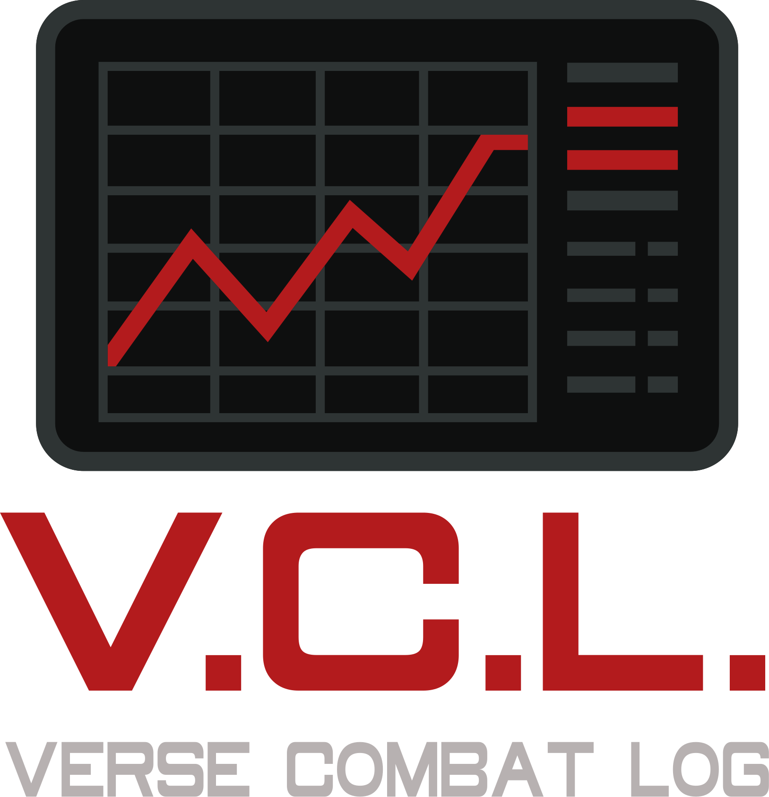

# ⭐ Verse Combat Log v1.0

<div align="center">



**Real-time Combat Statistics Tracker for Star Citizen**

Track kills, deaths, weapons, and vehicles with live statistics and player profiles from your Star Citizen game logs.

[](https://creativecommons.org/licenses/by-nc/4.0/)
[](https://www.python.org/downloads/)
[](https://robertsspaceindustries.com/)

[Features](#-features) • [Installation](#-installation) • [Usage](#-usage) • [Screenshots](#-screenshots) • [FAQ](#-faq)

</div>

---

## 🎯 Features

### ⚔️ Combat Tracking
- **Real-time Kill/Death** tracking from game logs
- **K/D Ratio** calculation (PvP and total)
- **Event Timeline** with timestamps
- **Session & Total Statistics**

### 🔫 Weapon & Vehicle Stats
- **Weapon Statistics** with kill counts
- **Vehicle Statistics** with variant aggregation
- **Custom Names** for weapons and vehicles
- **Blacklist System** to hide unwanted entries
- **Parent-Vehicle Aggregation** (e.g., combine all Hornet variants)

### 👤 Player Profiles
- **Player Cards** with kill/death history
- **RSI Profile Integration** (avatar, org, bio)
- **Persistent Player Database**
- **Click-to-view** detailed profiles

### 🛠️ Advanced Features
- **Multi-Version Support** (LIVE, PTU, EPTU, TECH-PREVIEW)
- **Auto-Update System** for weapon/vehicle names
- **NPC Pattern Filtering** for cleaner stats
- **Custom internalNames.ini** support (German/English names)
- **Dark Modern UI** with smooth animations

---

## 📦 Installation

### Option 1: Download Pre-built EXE (Recommended)

1. Go to [Releases](../../releases/latest)
2. Download `VerseCombatLog.exe`
3. Place in any folder
4. Run `VerseCombatLog.exe`

⚠️ **Windows SmartScreen Warning**: Click "More info" → "Run anyway"

### Option 2: Run from Source

```bash
# Clone repository
git clone https://github.com/SeBoOne/verse-combat-log.git
cd verse-combat-log

# Install dependencies
pip install -r requirements.txt

# Run application
python app.py
```

---

## 🚀 Usage

### First Start

1. **Select Version**: Choose LIVE, PTU, EPTU, or TECH-PREVIEW
2. **Set Log Path**: Settings → Enter path to your `Game.log`
   - Example: `C:\Program Files\Roberts Space Industries\StarCitizen\LIVE\Game.log`
3. **Play Star Citizen**: The tool tracks events automatically

### Finding Your Game.log

**Default Locations:**
- **LIVE**: `C:\Program Files\Roberts Space Industries\StarCitizen\LIVE\Game.log`
- **PTU**: `C:\Program Files\Roberts Space Industries\StarCitizen\PTU\Game.log`
- **EPTU**: `C:\Program Files\Roberts Space Industries\StarCitizen\EPTU\Game.log`

### Features Overview

- **Session Tab**: Current session statistics (reset with "Session zurücksetzen")
- **Gesamt Tab**: All-time statistics across all sessions
- **Spieler Tab**: Player database with kill/death records
- **Einstellungen**: Configure log paths, customize names, manage filters

---

## ❓ FAQ

<details>
<summary><b>Is this tool safe to use?</b></summary>

Yes! The tool:
- ✅ Only reads `Game.log` (read-only access)
- ✅ Does NOT modify any game files
- ✅ Does NOT interact with the game process
- ✅ Is fully open source (you can review the code)

CIG has confirmed that log-reading tools are allowed.
</details>

<details>
<summary><b>Why is my antivirus flagging it?</b></summary>

PyInstaller-built executables sometimes trigger false positives. This is normal!

**What you can do:**
- Check the [VirusTotal scan](../../releases/latest) (link in release notes)
- Verify the SHA256 hash matches the official release
- Run from source if you're concerned
- Add exception to your antivirus

The source code is fully available for review.
</details>

<details>
<summary><b>The tool shows no data!</b></summary>

**Checklist:**
1. Is the correct version selected? (LIVE/PTU/EPTU)
2. Is the log path correct? (Settings → Log-Pfad)
3. Have you played since starting the tool?
4. Does `Game.log` exist and is it being updated?

**Debug Mode:**
```bash
VerseCombatLog.exe --debug
```
This opens a console with detailed logs.
</details>

<details>
<summary><b>Can I use custom weapon/vehicle names?</b></summary>

Yes! Two ways:

1. **Built-in Editor**: Settings → Waffen/Fahrzeuge → Edit display names
2. **Custom INI**: Place your own `internalNames.ini` in `VCL-Files/` folder

The tool automatically downloads the latest community INI on first start.
</details>

<details>
<summary><b>How do I reset my statistics?</b></summary>

**Session Stats**: Click "Session zurücksetzen" in the Session tab

**Total Stats**: Delete the JSON files in the tool's folder:
- `stats_live.json`, `stats_ptu.json`, etc.
- `players_db_live.json`, `players_db_ptu.json`, etc.
</details>

---

## 🛡️ Privacy & Security

### What the tool does:
- ✅ Reads `Game.log` locally (no file modifications)
- ✅ Stores statistics in local JSON files
- ✅ Fetches RSI profiles when you click on a player (optional)
- ✅ Downloads `internalNames.ini` from GitHub (one-time, optional)

### What the tool does NOT do:
- ❌ No telemetry or analytics
- ❌ No data collection
- ❌ No internet communication (except RSI profiles & INI updates)
- ❌ No game file modifications
- ❌ No admin rights required

### Local Server:
The tool runs a local Flask server on `127.0.0.1:5000` - only accessible from your PC, not from the network.

---

## 🤝 Contributing

Contributions are welcome! Please see [CONTRIBUTING.md](CONTRIBUTING.md) for guidelines.

**Ways to contribute:**
- 🐛 Report bugs via [Issues](../../issues)
- 💡 Suggest features

---

## 📄 License

This project is licensed under the **Creative Commons Attribution-NonCommercial 4.0 International License**.

**VerseCombatLog © 2025 by SeBoOne** is licensed under [CC BY-NC 4.0](https://creativecommons.org/licenses/by-nc/4.0/)

You are free to:
- ✅ **Share** — copy and redistribute in any medium or format
- ✅ **Adapt** — remix, transform, and build upon the material

Under the following terms:
- 📝 **Attribution** — Give appropriate credit
- 🚫 **NonCommercial** — Not for commercial use

See [LICENSE](LICENSE) file for full details.

---

## 📝 Disclaimer

**This is an unofficial Star Citizen fantool, not affiliated with the Cloud Imperium group of companies.**

All content in this tool not authored by its host or users are property of their respective owners.

[**Star Citizen®, Roberts Space Industries® and Cloud Imperium®**](https://robertsspaceindustries.com) are registered trademarks of Cloud Imperium Rights LLC.

---

## 👨‍💻 Author

**Created by SeBoOne**

Community tool for Star Citizen players - had fun making it!

---

## ⭐ Support

If you find this tool useful, consider:
- ⭐ Starring this repository
- 🐛 Reporting bugs
- 💡 Suggesting features
- 📢 Sharing with other Citizens

**o7 Citizens! See you in the Verse!**
